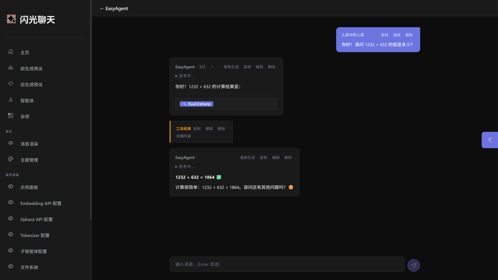
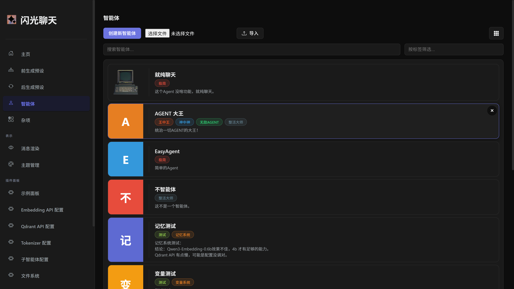
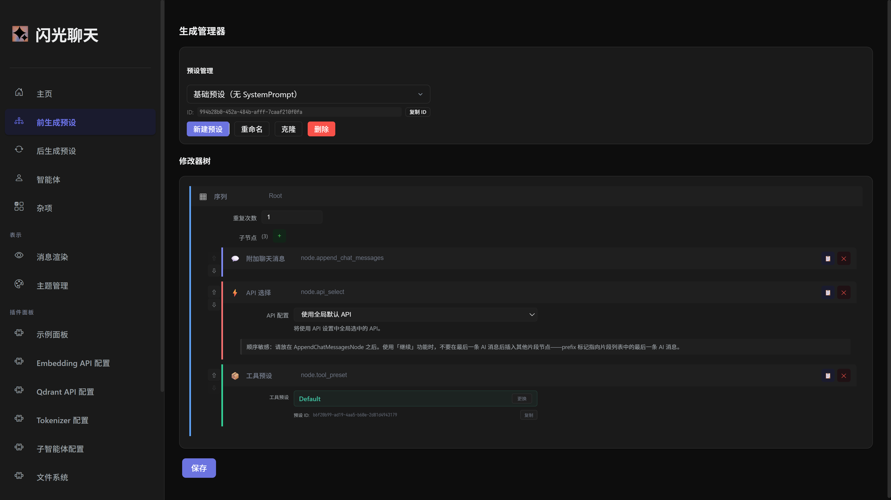

<div align="center">

# ✨ ShimmerChat 2 ✨

**An AI Chat App for Desktop Users Powered by Editable Node-Tree Pipelines — Orchestrate the Full LLM Generation Chain**

[](LICENSE.txt)
[](https://dotnet.microsoft.com/)
[](https://dotnet.microsoft.com/apps/aspnet/web-apps/blazor)


</div>

> 📖 [中文版本](README.md)

---

## 🌟 Core Concept

ShimmerChat 2.0 is built around **three editable node-tree pipelines**. Each AI generation pass is split into three stages, each freely configurable by the user through a visual node editor:

```
Pre-Generation Tree ──→ LLM Generation ──→ Post-Generation Tree ──→ Render Modifier Tree ──→ Display
```

| Pipeline | Responsibility |
|----------|---------------|
| **Pre-Generation** | Build context: inject system prompts, chat history, tool declarations, select API |
| **Post-Generation** | Process raw LLM response: post-processing, formatting, result transformation |
| **Render Modifier** | Markdown → HTML render pipeline: regex replacements, display modifications |

## 🌟 Features

| Feature | Description |
|---------|-------------|
| 🧩 **Visual Node Editor** | Drag-and-drop node tree editing, freely combine 22+ built-in nodes (conditionals, sub-agents, dynamic templates, tool presets, etc.) |
| 🤖 **Smart Agent System** | Each Agent has independent three-pipeline node tree configuration for differentiated behavior |
| 🔧 **Tool Call System** | Full Function Calling support, streaming Tool Call loop, automatic tool discovery and instantiation |
| 🧠 **SubAgent** | Nest other Agents within a node tree, building complex collaboration workflows |
| 🎨 **Theme System** | Full theme CRUD + import/export, CSS variable driven |
| 💾 **Persistent Storage** | LiteDB embedded database / JSON file dual-mode, automatic migration |
| 🔌 **Plugin System** | Dynamic assembly loading, nodes/tools/panels all plugin-based, equal status with built-in features |
| 🌐 **Multi-language** | zh-CN / en-US localization, instant switching |
| 🖥️ **Desktop App** | Tauri v2 desktop shell, one-click packaging as native desktop application |
| ⚙️ **Multi-API Support** | OpenAI, Ollama, Kobold and more LLM APIs |

<div align="center">

### 🖼️ Screenshots


> *Chat Interface*


> *Agent Configuration*


> *Node Editor*

</div>

---

## 🛠️ Tech Stack

| Technology | Purpose |
|-----------|---------|
| **.NET 10** | Runtime framework |
| **Blazor Server** | Web application framework |
| **SharperLLM** | In-house LLM connection library (Tool Call, streaming, multi-API adaptation) |
| **LiteDB** | Embedded NoSQL database |
| **Markdig** | Markdown → HTML rendering |
| **Newtonsoft.Json** | JSON serialization |
| **Tauri v2** | Desktop app packaging |
| **Bootstrap Icons** | UI icons |

---

## 📋 System Requirements

- **.NET 10 SDK** or later
- **OS**: Windows, Linux, macOS (macOS not thoroughly tested)

---

## 🚀 Quick Start

### Install .NET 10

- [Windows](https://learn.microsoft.com/en-us/dotnet/core/install/windows)
- [Linux](https://learn.microsoft.com/en-us/dotnet/core/install/linux)
- [macOS](https://learn.microsoft.com/en-us/dotnet/core/install/macos)

### Clone the Repository

```bash
git clone --recurse-submodules https://github.com/Kas1o/ShimmerChat.git
```

<details>
<summary>Forgot --recurse-submodules?</summary>

```bash
cd ShimmerChat
git submodule init
git submodule update
```

</details>

### Build & Run

```bash
cd ./ShimmerChat
dotnet run
```

---

## ⚙️ Configuration

### API Configuration

Configure your LLM backend on the "API Settings" page:

- **OpenAI API** — OpenAI-protocol-compatible APIs (URL, key, model)
- **Ollama API** — Local Ollama service
- **Kobold API** — Full Kobold parameters (temperature, context length, repetition penalty, samplers, etc.)

### Port Configuration

Add a Kestrel node in `appsettings.json`:

```json
{
  "Kestrel": {
    "Endpoints": {
      "Http": {
        "Url": "http://localhost:5000"
      }
    }
  }
}
```

---

## 🔌 Plugin System

Place plugins in the `Plugins/` directory — they are automatically discovered and loaded at startup, with full parity with built-in features. Built-in extensions include:

| Module | Function |
|--------|----------|
| **DynPrompt** | Dynamic template prompt system |
| **Variable** | Variable definition and injection |
| **Memory** | Persistent memory storage |
| **SubAgent** | Sub-agent nesting call node |
| **FileSystem** | File read/write toolset |
| **RegexModifier** | Regex replacement render modifier |
| **InvokeCSharp** | Custom C# code execution |

---

## 🏗️ Project Structure

```
ShimmerChat/
├── SharperLLM/           # LLM connection library (submodule)
├── ShimmerChatLib/       # Shared library: models, interfaces, pipeline core abstractions
├── ShimmerChat/          # Main project: Blazor Server host, service implementations, UI
├── ShimmerChatBuiltin/   # Built-in plugins: default nodes, tools, panels
├── src-tauri/            # Tauri desktop publishing project
└── Docs/                 # Developer documentation
```

---

## 📄 Third-Party Licenses

- [LiteDB](https://github.com/mbdavid/LiteDB) — MIT
- [Markdig](https://github.com/xoofx/markdig) — BSD-2-Clause
- [Nerdbank.GitVersioning](https://github.com/dotnet/Nerdbank.GitVersioning) — MIT
- [Newtonsoft.Json](https://github.com/JamesNK/Newtonsoft.Json) — MIT
- [qdrant-dotnet](https://github.com/qdrant/qdrant-dotnet) — Apache-2.0
- [SharperLLM](https://github.com/Kas1o/SharperLLM) — MIT
- [Tokenizers.HuggingFace.DotNet](https://github.com/IgnaciodelaTorreArias/Tokenizers.HuggingFace.DotNet) — Apache-2.0
- [Bootstrap Icons](https://github.com/uiwjs/bootstrap-icons) — MIT
